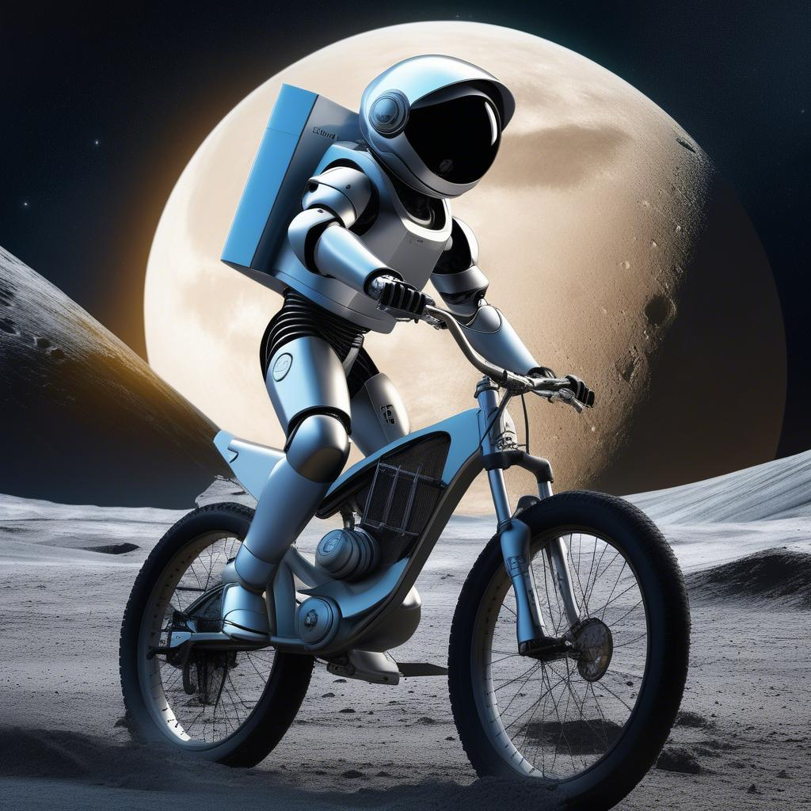

# AI Image Generator with Stable Diffusion & OpenJourney

A powerful command-line tool that generates stunning images using state-of-the-art AI models. This tool provides access to multiple high-quality image generation models including Stable Diffusion XL, Stable Diffusion 2.1, and OpenJourney, allowing you to create unique and detailed images from text descriptions.

## 🌟 Showcase

### Example Generation
**Prompt:** "A robot riding a bicycle on Moon with glazing earth in the background"

#### Terminal Interface


#### Generated Image


## ✨ Features

- **Multiple AI Models:**
  - Stable Diffusion XL (High-quality, detailed images)
  - Stable Diffusion 2.1 (Balanced quality and speed)
  - OpenJourney (Midjourney-like artistic style)

- **User-Friendly Interface:**
  - Interactive command-line interface
  - Colored output for better readability
  - Progress indicators
  - Detailed generation information

- **Smart File Management:**
  - Organized output directory
  - Timestamped filenames
  - Automatic file size formatting
  - Model-specific file naming

- **Optimized Generation:**
  - Model-specific parameters
  - Enhanced negative prompts
  - High-resolution output (1024x1024)
  - Quality-focused settings

## 🛠️ Technologies Used

- Node.js
- Hugging Face Inference API
- Stable Diffusion Models
- OpenJourney Model
- Chalk (for terminal styling)

## 🚀 Setup

1. Clone the repository:
```bash
git clone https://github.com/cswiz2003/ai-image-generator.git
cd ai-image-generator
```

2. Install dependencies:
```bash
npm install
```

3. Create a `.env` file in the root directory and add your Hugging Face API key:
```env
HUGGINGFACE_API_KEY=your_api_key_here
```

## 💻 Usage

1. Start the application:
```bash
node test-image-generation.js
```

2. Select a model (1-3) when prompted
3. Enter your image description
4. Wait for the generation to complete
5. Find your generated image in the `generated-images` folder

## 🤝 Contributing

Contributions are welcome! Please feel free to submit a Pull Request. For major changes, please open an issue first to discuss what you would like to change.

## 📝 License

This project is licensed under the MIT License - see the [LICENSE](LICENSE) file for details.

## 🙏 Acknowledgments

- [Hugging Face](https://huggingface.co/) for providing the AI models and API
- [Stability AI](https://stability.ai/) for Stable Diffusion models
- [OpenJourney](https://huggingface.co/prompthero/openjourney) for the artistic model

## 📧 Contact
Feel free to reach out:
- LinkedIn: [https://www.linkedin.com/in/shafique17z/](https://www.linkedin.com/in/shafique7z/)

---

<p align="center">Made with ❤️ by Shafique</p> 
